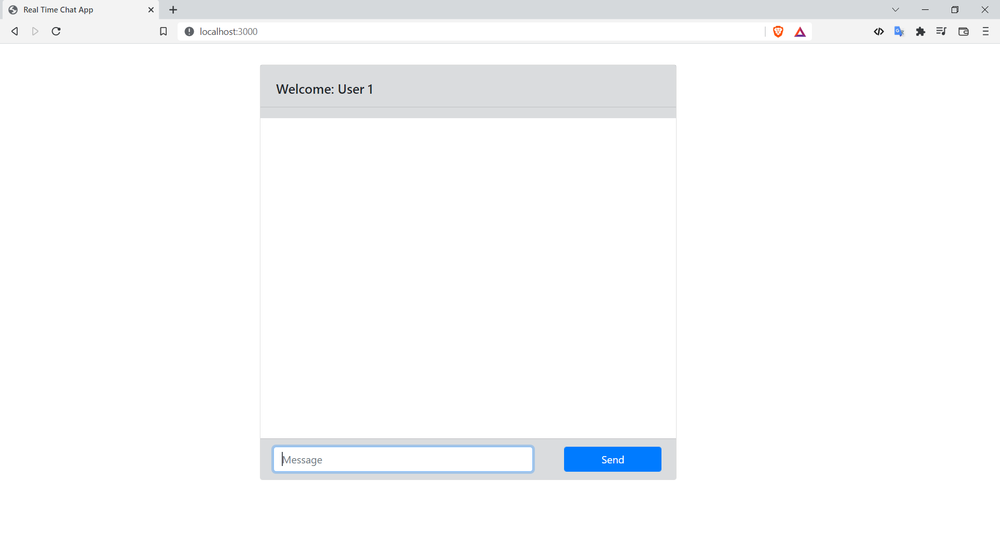

# react-chat-app
## 1. Project Description
- This project built to show a basic example of real time chat app using React JS and WebSocket. 
## 2. Project Scopes
- Before entering the chat, the user is prompted to enter their username, which is further used to identify their messages
- Implement saving messages in memory ( in local storage, without a backend)
- Each new browser tab is a new chat user. The new messages in the chat room should be updated to all opened tabs ( live updating for all users ) without using socket.io all.
- Implement functionality for sending messages to chat
- Implement ScrollIntoView when send or receive new messages
- Show username when hover over profile picture
- Implement functionality for show message history, and load more messages when scroll chats to the top. (In Progress...)
## 3. Technologies and Dependencies
- Technologies: React JS, Bootstrap
- Dependencies: http, serve-handler and websocket (ws)
## 4. Code Walkthrough
###### 1. Initialized Project:
- Create folder for the project
- Run `npm init` in your terminal or run `npx create-react-app folder-name` directly in your terminal
- Install dependencies as mentioned above: `npm i http serve-handler ws`
###### 2. Implementing the Server (***index.js***):
- We first set up an HTTP server and route all requests to a special handler that will serve all static files from the public directory. This is required in order to access our application's client-side resources (for example, HTML, JavaScript, and CSS files).
- Then, we launch a new instance of the WebSocket server and connect it to our existing HTTP server. Then, by attaching an event listener to the connection event, we begin listening for incoming WebSocket client connections.
- We begin listening for incoming messages whenever a new client connects to our server. When a new message arrives, we broadcast it to all clients who are connected.
- The sendMessage() function or known as broadcast function simply iterates over all known clients, invoking the send() function on each connected client. This is the Node.js magic! Of course, the server we just built is very simple and basic, but as we will see, it serves its purpose.
###### 2. Implementing the Client (***index.html***):
- This can be done with another compact and simple fragment of code, essentially a minimal HTML page with some basic JavaScript code.
- You can also separate JavaScript from HTML, by just giving source to the JavaScript file ``
- We use the native WebSocket object to establish a connection to our Node.js server and then begin listening for server messages, displaying them in new div elements as they arrive.
- Because the server messages are binary data, we use a JavaScript Object called `FileReader` to read the contents of this data (or raw data buffers)
- Instead, we use a simple textbox and a button within a form to send messages.
## 5. Running Application
- We can try to run our application immediately. Just launch the server with the following command: `node index.js port` (i.e: `node index.js 3000`)
- Then, open a couple of browser tabs or even two different browsers, point them at `http://localhost:port` (i.e: `http://localhost:3000`), and start chatting
- **NOTE:** You can see username when hover over profile picture

